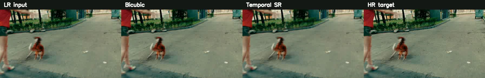

# Mini-DLSS

Mini-DLSS (DLSS-inspired, not NVIDIA DLSS): temporal video super-resolution trained on public VSR datasets, evaluated with standard SR metrics (PSNR/SSIM) plus temporal stability checks, and exported to ONNX for reproducible deployment experiments.



Preview: LR input, bicubic, Temporal SR, and HR target on the local REDS-style validation/demo set.

## Latest Evaluation And Demo

Final evaluation artifacts from the Drive-trained `temporal_vsr_5f_small_2x` checkpoint are documented in [results/FINAL_EVALUATION_DEMO_2026-06-02.md](results/FINAL_EVALUATION_DEMO_2026-06-02.md).

Best checkpoint:

```text
results/runs/temporal_vsr_5f_small_2x/checkpoints/best.pt
```

| Method | PSNR-Y | SSIM-Y | tPSNR | diff_energy |
| --- | ---: | ---: | ---: | ---: |
| Bicubic | 36.8033 | 0.9601 | 36.3441 | 0.0217 |
| Single-frame SR fast-cycle (300 steps) | 32.3755 | 0.8807 | 33.8817 | 0.0183 |
| Temporal SR 5f small | 38.3265 | 0.9604 | 36.6018 | 0.0201 |

These metrics are from a local Vimeo-derived REDS-style validation/demo set. They are useful for reproducible pipeline validation and demo comparison, but should not be cited as official REDS benchmark results.

The single-frame SR baseline uses `results/runs/week3_single_frame_fast_localreds/checkpoints/best.pt`, a 300-step fast-cycle checkpoint. It is included as a pipeline sanity baseline, not as a budget-matched ablation against the temporal checkpoint.

Recruiter/demo artifacts:

- Comparison videos: `results/final/videos/final_temporal_vsr_5f_small_2x/`
- Labeled 10-second comparison: `results/final/videos/final_temporal_vsr_5f_small_2x/all_val_comparison_10s_labeled.mp4`
- Fixed 10-second PyTorch CPU demo: `results/final/demo/temporal_vsr_5f_small_2x_10s.mp4` (`34.941 ms/frame` measured by `demo_video.py`)
- ONNX export: `results/onnx/temporal_vsr_5f_small_2x.onnx`
- ONNX Runtime latency: not yet benchmarked

## 1) Scope

- Task: temporal video super-resolution.
- Upscale factor: `2x` (fixed for all experiments).
- Focus: ML pipeline, model training, benchmarking, and deployment.
- Out of scope (for now): game-engine integration and custom rendering pipelines.

## 2) Datasets

- Train: Vimeo-90K Septuplets, using the local union of Kaggle subsets `vimeo-90k-3` + `vimeo-90k-4`.
- Eval/demo: REDS-style validation set generated from Vimeo for local pipeline validation.
- Eval/demo paths: `data/raw/reds/val_sharp`, `data/raw/reds/val_sharp_bicubic/X2`, and `data/splits/reds_val.txt`.
- Important: the local eval/demo files use REDS-like IDs `240` to `259`, but these are not official REDS validation results unless the paths are replaced with official REDS data and evaluation is rerun.
- Split rule: no overlapping source Vimeo sequences between train/val/test subsets.
- Local default setup in this repo uses:
  - train sequence root: `data/raw/vimeo90k_union/sequence`
  - train manifests: `data/splits/vimeo90k_union_{train,val,test}.txt`

## 3) Baselines and Model Path

- Baseline A: bicubic upscaling.
- Baseline B: single-image SR applied frame-by-frame. The current reported checkpoint is a fast-cycle pipeline baseline, not a budget-matched final ablation.
- Ours: BasicVSR-style temporal model.
- Training path:
  - Stage 1: `BasicVSR-Small` for pipeline validation and quick cycles.
  - Stage 2: Drive-trained `temporal_vsr_5f_small_2x` final run for the reported artifacts.
- Optional extension: temporal consistency loss and/or flow-assisted alignment.

## 4) Evaluation Protocol (Locked)

- Primary quality metrics: `PSNR` and `SSIM`.
- Primary reporting domain: `Y` channel in YCbCr.
- Secondary sanity report: RGB PSNR/SSIM (optional).
- Border crop before PSNR/SSIM: crop `scale` pixels on each side (`2` pixels for 2x).
- Temporal stability metric:
  - Preferred: flow-warped temporal PSNR (`tPSNR`) between consecutive outputs.
  - Fallback: frame-to-frame difference energy in low-texture regions.
- Report set:
  - Local REDS-style validation aggregate metrics.
  - Curated qualitative clips (side-by-side LR/Bicubic/Single-frame/Temporal/GT).

## 5) Compute and Reproducibility

- Runtime target: Google Colab GPU for training.
- All runs resumable with periodic checkpoints.
- Validation runs at fixed interval during training.
- Two experiment tiers:
  - Fast cycle: short training budget for iteration/debugging.
  - Full cycle: long budget for final reporting.
- Seeds/configs/checkpoints tracked per run for reproducibility.

The final checkpoint metadata records `step = 80000`, `best_metric = 38.3265`, and a Drive training override with `train.max_steps = 150000`. The checked-in `configs/temporal_small.toml` defines the architecture and local defaults; reproduce the exact final training budget by applying the recorded override.

## 6) Definition of Done

- Temporal model improves local REDS-style PSNR over bicubic and establishes a reproducible evaluation/demo package.
- A budget-matched single-frame baseline should be trained before making a final single-frame-vs-temporal ablation claim.
- ONNX export succeeds; PyTorch CPU demo inference runs on a fixed 10-second clip with reported latency (`ms/frame`) on the local machine.
- Repo includes reproducible train/eval/export/demo commands and final results artifacts.

## 7) Execution Plan (8 Weeks)

- Week 1: lock protocol, metrics, splits, and run tracker format.
- Week 2: data ingestion, alignment checks, window sampling checks.
- Week 3: baseline training/eval and auto-generated markdown results table.
- Week 4: BasicVSR-Small training and validation loop stabilization.
- Week 5: quality-focused temporal training and reproducible best-checkpoint eval.
- Week 6: planned ablations (3/5/7 frames, loss variants, tiny speed model) and latency chart.
- Week 7: ONNX export + mp4 demo CLI.
- Week 8: final report page with metrics, videos, failure cases, and tradeoff analysis.

## 8) Completed Runs And Planned Ablations

Completed final artifacts:

1. `bicubic`
2. `single_frame_sr` fast-cycle pipeline baseline
3. `temporal_vsr_5f_small_2x`

Planned ablations / future work:

1. Budget-matched `single_frame_sr`
2. `temporal_vsr_3f`
3. `temporal_vsr_7f`
4. `temporal_vsr_5f_l1_perceptual`
5. `temporal_vsr_5f_tiny` speed-oriented model

## 9) Repo Layout

```text
mini-dlss/
  configs/
  data/
    scripts/
    splits/
  models/
  metrics/
  notebooks/
  results/
    tables/
    videos/
  train.py
  eval.py
  export_onnx.py
  demo_video.py
  README.md
```

## 10) Command Checklist

Week 2 dataset check (clip counts + LR/HR alignment + temporal windows):

```bash
python data/scripts/freeze_vimeo_splits.py --vimeo-root /path/to/vimeo90k
python data/scripts/freeze_vimeo_union_splits.py \
  --vimeo-a data/raw/kagglehub/datasets/wangsally/vimeo-90k-3/versions/1 \
  --vimeo-b data/raw/kagglehub/datasets/wangsally/vimeo-90k-4/versions/1
python data/scripts/build_vimeo_union_root.py \
  --seq-a data/raw/kagglehub/datasets/wangsally/vimeo-90k-3/versions/1/sequence \
  --seq-b data/raw/kagglehub/datasets/wangsally/vimeo-90k-4/versions/1/sequence

python data/scripts/check_dataset.py \
  --hr-root data/raw/reds/val_sharp \
  --lr-root data/raw/reds/val_sharp_bicubic/X2 \
  --manifest data/splits/reds_val.txt \
  --num-frames 5 \
  --scale 2
```

If official REDS is not available, build a local REDS-style val set from Vimeo for pipeline validation:

```bash
python data/scripts/create_reds_val_from_vimeo.py
```

Week 3 baseline eval (writes markdown table + example media):

```bash
python eval.py \
  --config configs/temporal_small.toml \
  --mode bicubic \
  --save-videos 2 \
  --save-images 8
```

Week 4/5 temporal training for the final reported model:

```bash
python train.py --config configs/temporal_small.toml \
  --override '{"train":{"max_steps":150000,"val_interval":5000,"checkpoint_interval":5000},"eval":{"max_batches":50}}'
```

Week 5 reproducible best-checkpoint evaluation:

```bash
python eval.py \
  --config configs/temporal_small.toml \
  --mode model \
  --checkpoint results/runs/temporal_vsr_5f_small_2x/checkpoints/best.pt \
  --device cpu \
  --output-dir results/final
```

Week 6 planned ablation tracking:

```bash
# Fill run rows in results/tables/experiment_tracker_template.md
# Then copy summary into results/tables/ablation_table.md
```

Week 7 ONNX export:

```bash
python export_onnx.py \
  --config configs/temporal_small.toml \
  --checkpoint results/runs/temporal_vsr_5f_small_2x/checkpoints/best.pt \
  --output results/onnx/temporal_vsr_5f_small_2x.onnx
```

Week 7 PyTorch CPU demo inference on fixed 10-second LR mp4:

```bash
python demo_video.py \
  --input results/week3/latency_input_10s_lr.mp4 \
  --output results/final/demo/temporal_vsr_5f_small_2x_10s.mp4 \
  --config configs/temporal_small.toml \
  --checkpoint results/runs/temporal_vsr_5f_small_2x/checkpoints/best.pt \
  --device cpu \
  --fps 24
```

## 11) Reproducibility Rules

- Keep `scale=2` in all configs.
- Use only manifests in `data/splits/`.
- Log every run in `results/tables/experiment_tracker_template.md`.
- Report Y-channel metrics with crop border = 2.
- Record the same fixed 10-second clip for PyTorch CPU latency (`ms/frame`).
- Report official REDS metrics only after replacing the local REDS-style generated data with official REDS data and rerunning evaluation.
